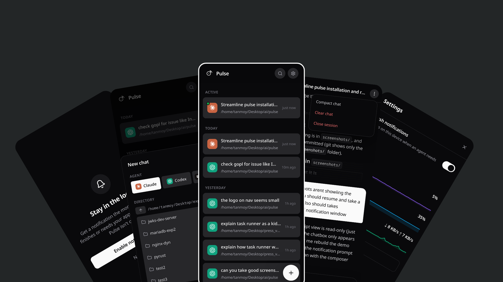
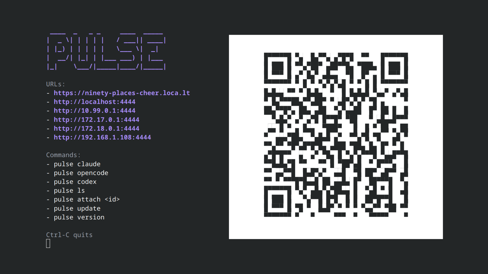

<p align="center">
  
</p>

<h1 align="center">Pulse</h1>

<p align="center">
  <strong>Drive your terminal coding agents from your phone</strong>
</p>

Pulse makes it simple to run [Claude Code](https://claude.com/claude-code),
[Codex](https://openai.com/codex), and [OpenCode](https://opencode.ai) from your
phone. Use the mobile UI to browse transcripts, start or resume chats, send
prompts, approve tools, switch models, and get notified when an agent needs you.






## Key Features

- Control Claude Code, Codex, and OpenCode from one mobile UI.
- Start new sessions or resume existing sessions from your phone.
- Stream transcripts live, send prompts, and approve tool calls remotely.
- Switch models and receive notifications when an agent needs attention.
- Keep each agent's existing history and global configuration untouched.

## Install

```bash
curl -fsSL https://raw.githubusercontent.com/tanmoysrt/pulse/master/install.sh | sh
```


## Usage

```bash
pulse
pulse <claude|codex|opencode> [args...]
pulse ls
pulse attach <id>
pulse update
pulse add-domain <domain-or-ip>
```

`pulse add-domain` issues (or confirms) a Let's Encrypt certificate for a
domain or IP ahead of time, so the setup wizard's "Let's Encrypt" option has
something to serve. Run it once (as root, or with sudo) before choosing that
option; pulse itself never requests or renews a certificate while running —
re-run this command to renew.

## How it works

Each session runs in a detached tmux, and Pulse streams its transcript to the
browser. It reads history from each tool's own store and never touches your
global agent config.

While Pulse is running, it prevents automatic system sleep so its server,
network connection, and detached sessions stay available. The display may still
turn off or lock normally.

## Build from source

```bash
make prod        # builds the UI and stripped binaries for every platform in dist/
```

## License

[Apache 2.0](LICENSE)
